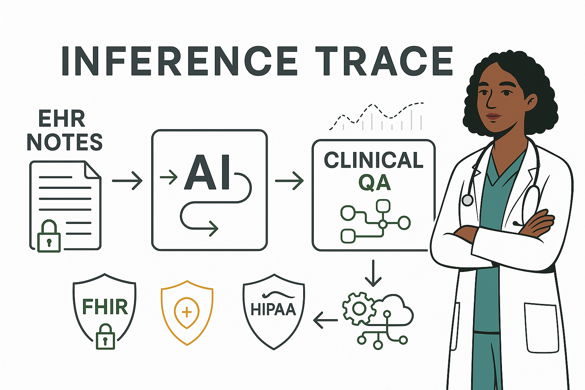

# 🏥 Inference Trace: GenAI’s 2nd Opinion

### *An Ethical, Modular Clinical Decision Support Pipeline for ICU Patient Summarization*

<p align="center">
  
</p>

<p align="center">
  
  
  
  
  
  
</p>

---

## 📌 Overview

**Inference Trace: GenAI’s 2nd Opinion** is a modular, end-to-end **Clinical Decision Support (CDS)** pipeline built on real ICU data from the MIMIC-IV database. It combines **explainable ML**, **FHIR compatibility**, and **GenAI-based clinical summarization** to simulate how modern, ethical, and transparent CDS systems can function in real-world hospital environments

This system is designed to:
- ✅ Ingest & normalize patient data as FHIR Bundles
- 🔍 Predict risks using structured ML models (e.g., Random Forest)
- 🧠 Provide explainability via SHAP + Permutation Importance
- 🩺 Summarize patient status using ClinicalBERT QA
- 📜 Log all model inferences & expose results for audit

> Built with fairness, traceability, and modularity at its core.

---

## Core Modules in `src/`

| Module | Purpose |
|--------|---------|
| `etl_mimic.py` | ETL pipeline: transforms MIMIC-IV CSVs into clean, FHIR-compatible Bundles |
| `icd9_decode.py` | Decodes ICD-9 codes using local dictionaries for interpretability |
| `train_los_model.py` | Trains a classifier to predict patient Length of Stay |
| `shap_model.py` | Generates SHAP + permutation importance for any classifier |
| `shap_model_iv.py` | Special SHAP workflow for ICU-focused risk modeling |
| `genai_infer.py` | Prompts GenAI (LLM) over patient Bundles for explainable summarization |

---

## 🧠 Explainability by Design

- ✅ **SHAP**: Feature-wise importance on individual patients
- ✅ **Permutation Importance**: Robust, model-agnostic interpretability
- ✅ **Injection**: Model explanations are written *into* each patient bundle
- ✅ **FHIR Alignment**: Explanations embedded without breaking resource structure

---

## 🤖 GenAI Summarization

- 🧬 Uses `emilyalsentzer/Bio_ClinicalBERT` for embeddings
- 💬 Prompts `NousResearch/Nous-Hermes-2-Mixtral-8x7B-DPO` via Hugging Face Inference API
- 🛡️ Clinical reasoning prompts written for **precision + interpretability**

```text
"You are a clinical reasoning assistant. Given the patient bundle, summarize risks and reasoning."
